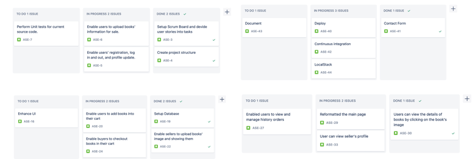

# Project Organisation
Our project team consisted of 3 members, and we used an adapted Scrum methodology to schedule tasks and manage the development process.

## Task scheduling and management

We used a combination of GitHub Project and Jira to manage our project tasks. We used GitHub Project to record our user stories, which allowed us to easily manage and track our product backlog. Additionally, we created a Scrum board using Jira to track the progress of tasks and ensure that everyone was on the same page. The board was divided into columns such as "To-do", "In Progress", and "Done" to reflect the different stages of the development process. Each task was assigned to a team member and given a due date.

We followed the standard Scrum process, which involved holding weekly stand-up meetings, sprint planning meetings, and sprint reviews. 
We divided the project into sprints that lasted two or three weeks each according to every deliverable session, and we set clear goals and priorities for each sprint.
At the beginning of each sprint, we hold a meeting and divided user stories on GitHub Project into tasks and documented in Jira and created scrum board for each sprint.

This is the screenshot of the backlog of our user story:

Here are the screenshots of our Scrum board:

## Timeline

We created a Gantt chart to provide an overview of the development timeline. The Gantt chart showed the major milestones of the project and the completion dates of each task. We updated the Gantt chart regularly to reflect the progress of the project.

Here is our Gantt chart:

## Versioning
We used Git for version control, which allowed us to work on different features and fixes simultaneously. To organize our development process, we adopted the Sprint Branch Model. Under this model, we created a new branch for each sprint, with the development of features and fixes for that sprint taking place within that branch. This helped to separate development from stable branches, improved collaboration among team members, increased flexibility and allowed for easier integration at the end of each sprint.

Our branching model followed the Sprint Branch Model and was designed to maintain the stability of the main branch while new features and fixes were being developed. Each sprint had its own branch, and features were developed and tested within that branch before being merged into the main branch at the end of the sprint.

Here are diagrams of our Git branching model under the Sprint Branch Model:

## Pull Requests
As we followed the Sprint Branch Model, we created pull requests at the end of each sprint to merge our sprint branch into the main branch. This allowed us to ensure that all the changes made during the sprint were thoroughly reviewed and tested before being merged into the main branch.

We took advantage of pull requests in several ways. It allowed us to review and discuss the code changes made by our team members. This helped us identify any potential issues or conflicts and ensured that the code met our standards and best practices. Also, pull requests helped us maintain a clean and organized codebase by enforcing our branching and merging strategy. All the code changes had to go through the pull request process before being merged, which helped us ensure that our codebase was always in a stable state.
