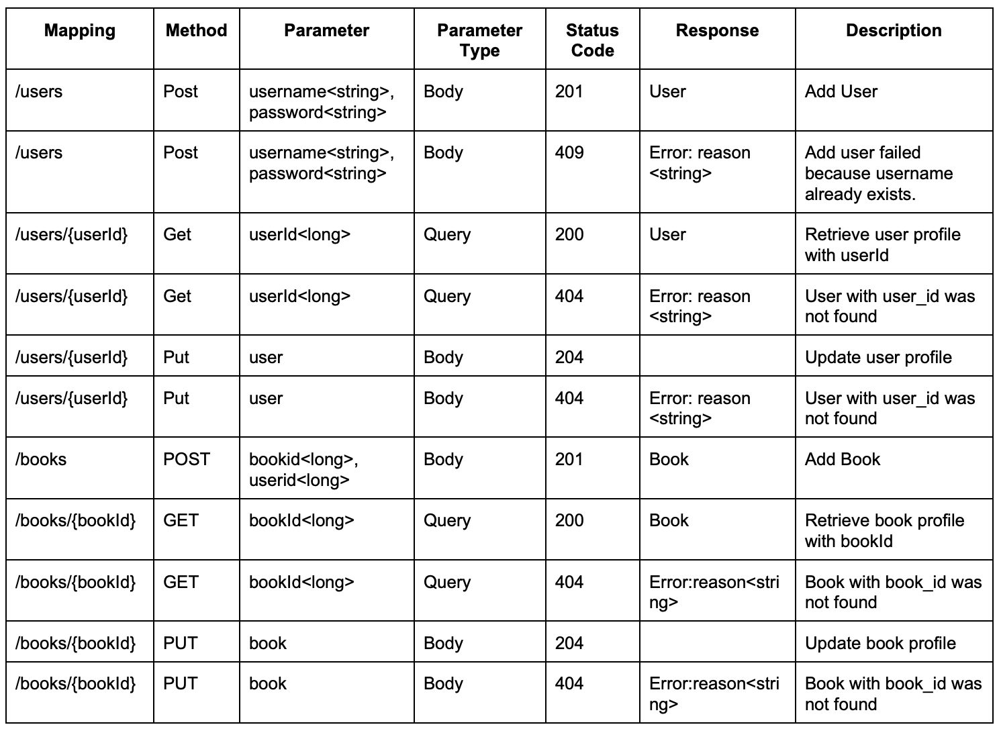

# Group-ASE-server

This is the server-side code for a Book E-Commerce web application developed by Group ASE as part of the FS23 Advanced Software Engineering course.
## REST Specification




## Set up local database and  link it to server program
First download and install Mysql: https://dev.mysql.com/downloads/mysql/  

Then log in Mysql in the terminal by entering: mysql -uroot -p

After enter the password, enter: CREATE DATABASE ase;

And you will have a database named ase which will store the book and user data

You can link the database to the program easily by just enter your username and password in the /src/main/resources/application.properties

After that the program is ready for use

## Building with Gradle
-   macOS: `./gradlew`
-   Linux: `./gradlew`
-   Windows: `./gradlew.bat`

### Build

```bash
./gradlew build
```

### Run

```bash
./gradlew bootRun
```

### Test

```bash
./gradlew test
```
